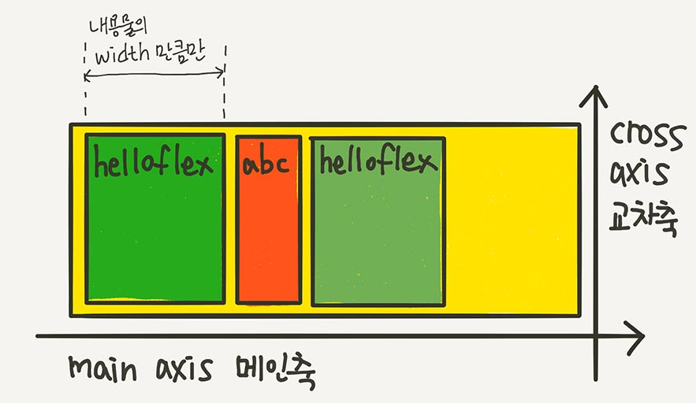
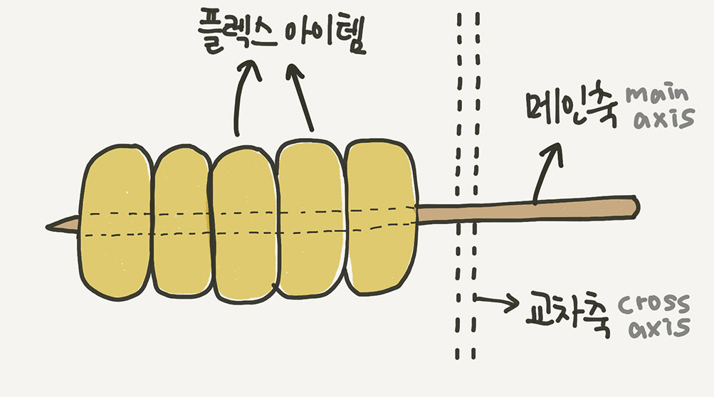
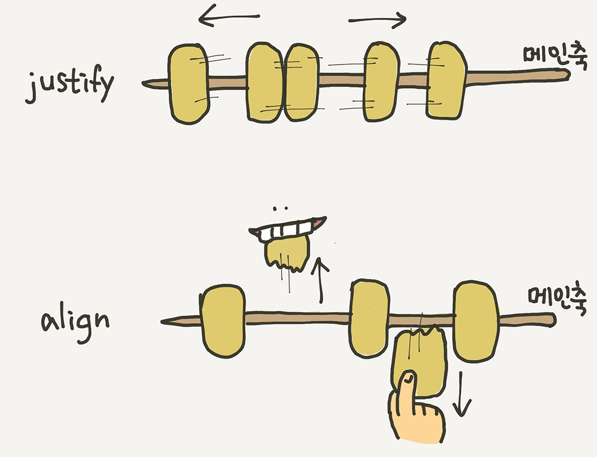

# FLEX

레이아웃 전용배치기능 

부모요소 flex contatiner 

 자식요소 flex item

- 컨테이너가 flex의 영향을 받는 전체 공간이고 , 설정된 속성에 따라 각각의 아이템들이 어떤 형태로 배치되는것

---

**display : flex;**

메인축 : main axis

수직축 : cross axis

---

### 1. 배치 방향 설정

flex-direction

아이템들이 배치되는 축의 방향을 결정 . 메인축의 방향을 가로로 할거냐 세로로 할거냐 

~~~
.container {
	flex-direction : row;
	/* flex-direction: column; */
	/* flex-direction: row-reverse; */
	// 아이템들 역순으로 세로 배치
	/* flex-direction: column-reverse; */
}
~~~

### 2. 줄넘김 처리 설정 

flex-direction

컨테이너가 더 이상 아이템들을 한 줄에 담을 여유 공간이 없을 때 아이템 줄바꿈을 어떻게 할지 결정하는 속성

~~~
.container {
	// 줄바꿈 x 
	flex-wrap: nowrap;
	// 줄바꿈 0
	/* flex-wrap: wrap; */
	/* flex-wrap: wrap-reverse; */
}
~~~

---

### 정렬

**"justify"는 메인축 방향으로 정렬**

**"align"은 수직축방향으로 정렬**

---

### 3. 메인축 방향 정렬

justify-content

~~~
.container {
	justify-content: flex-start;
	/* justify-content: flex-end; */
	/* justify-content: center; */
	//양쪽 끝 가운데 
	/* justify-content: space-between; */
	// 균일한 간격으로 
	/* justify-content: space-around; */
	//아이템들의 사이와 끝에 균일한 간격을 만들어줌 
	/* justify-content: space-evenly; */
}
~~~

---

### 4. 수직축 방향 정렬

align-items

~~~
.container {
	// 아이템들이 수직축 방향으로 끝까지 쭉 늘어남
	align-items: stretch;
	/* align-items: flex-start; */
	/* align-items: flex-end; */
	/* align-items: center; */
	//텍스트 베이스라인 기준으로 정렬
	/* align-items: baseline; */
}
~~~

### 5. 여러행 정렬

align-content

~~~
.container {
	flex-wrap: wrap;
	align-content: stretch;
	/* align-content: flex-start; */
	/* align-content: flex-end; */
	/* align-content: center; */
	/* align-content: space-between; */
	/* align-content: space-around; */
	/* align-content: space-evenly; */
}
~~~

