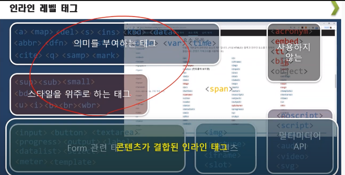

# html

마크업 언어 

전체적인 구조를 담당 

~~~
<div></div>
~~~


## 시멘틱 태그

```jsx
<header></header>
<main></main>
<footer></footer>
```

------

## 섹션 태그

제목과 컨텐츠를 감싼다

아웃라인을 정해준다

```html
<section>
</section>
<article> : 글내용이 있는것 
<nav> : 링크로된 글로 이루어진것 
<aside>: 보통 배너, 광고 기타 링크 등의 사이드바(side bar)를 통한 
핵심 Contents와는 관련이 없는 내용들에 적음
```

---

## **section 태그**

section의 조건

- 제목 + 내용(컨텐츠)

**시멘틱 section**

-article>header,footer,main(x)

-aside>header,footer,main(x)

-nav>header(x),footer(x),main(x)

-body>header,footer,main(o)

메인은 한번만 사용 가능하고 꼭 나오지 않아도 된다

section의 부분을 만드는 태그로 div가 사용되는데

section의 필수 영역에 대해서는 시멘틱한 태그가 추가 되었다

-header

-main

-footer

------



인라인태그들

------

**상대 경로 , 절대 경로**

/

./ 현재경로

../ 바로 위 경로

수정의 용이성 때문에 상대경로를 사용하는것이 좋다

------

a 태그

target : _black 새로운 탭에서 열림

button 태그

```html
<input type="submit" value="회원가입">
<button></button>

// 기능은 동일하나 밑에 버튼 태그는 안에 커스텀으로 수정할수 있다
```

## input 태그

**필수 입력 필드의 수정**

- 예전에는 자바스크립트로 막았다

```html
// 필수 입력 하지 않으면 경고
<input id="aa" required>

//숫자 입력
<input id="aa" type="number" min="10" max="200">
```

**자동완성 태그 입력 해제**

1. 브라우저 자동완성 해제
2. 특정 컬럼 자동완성 삭제

```html
<input id="aa" required autocomplete="off">
```

**datalist**

선택창에서 글자에 맞는 단어를 자동완성 시켜준다