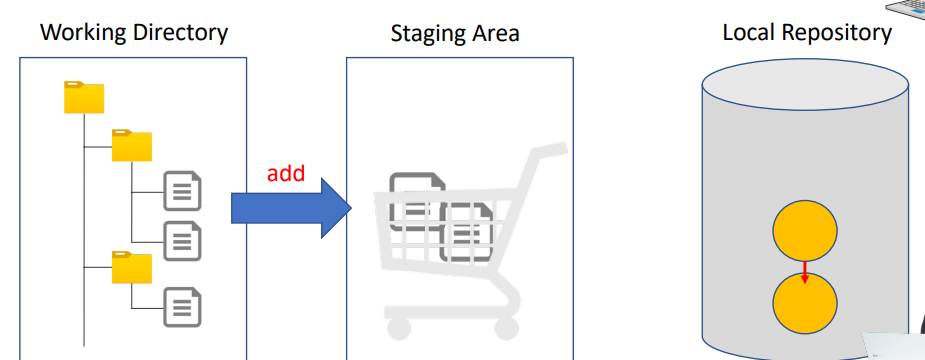
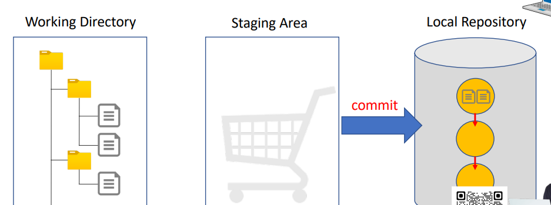

### GITHUB

---

Staging Area

---

**Staging Area에 추가**

git add 파일이름 

git add 파일이름1 파일이름2

git add 폴더이름 <-- 지정된 폴더 내의 모든 파일 추가

git add * <-- 현재 폴더에 있는 모든 파일 또는 폴더 추가 (빈폴더 제외)

git add -u <-- 커밋한 적이 있는 모든 파일 추가 (해당 파일이 커밋 이력에 있어야함)

##### Staging Area에서 삭제

git rm --cached 파일이름

git reset 파일 이름

git reset <-- 현재폴더의 모든 폴더와 파일을 Staging Area에서 삭제

##### Working Diectory 와 Staging Area의 상태를 확인

 git status

---

커밋 

##### 커밋 생성하기

git commit -m "inital commit" <-- ""안에 커밋에 대한 설명을 적는다

git show HEAD <-- 최근 커밋의 내역을 볼수 있다 . (커밋 메시지 수정가능)

git log

##### 커밋 수정하기

git commit --amend <-- 최근 커밋의 내용을 볼수 있다 

git commit --amend -sm "변경된 메시지" <-- 커밋 메세지만 수정하고 싶을때 

##### 취소 커밋 생성하기

git revert HEAD <-- 최근 커밋을 취소하는 새로운 커밋을 생성 

