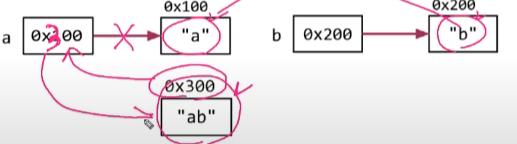
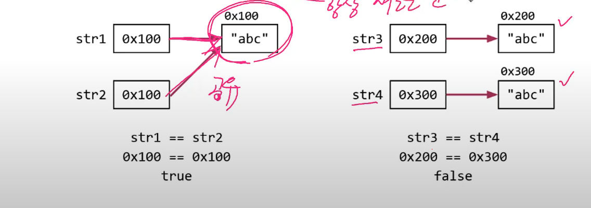
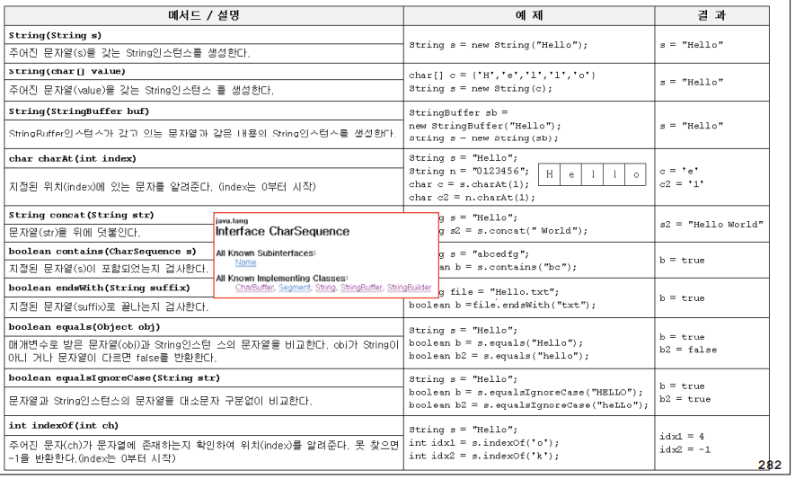
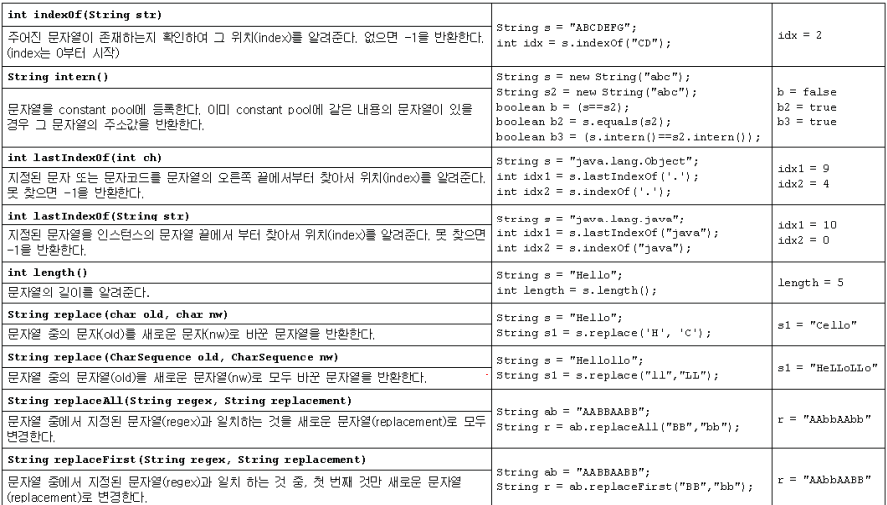
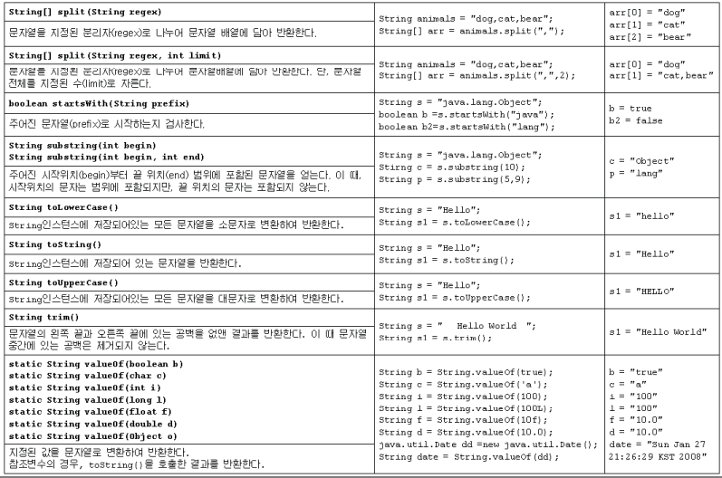
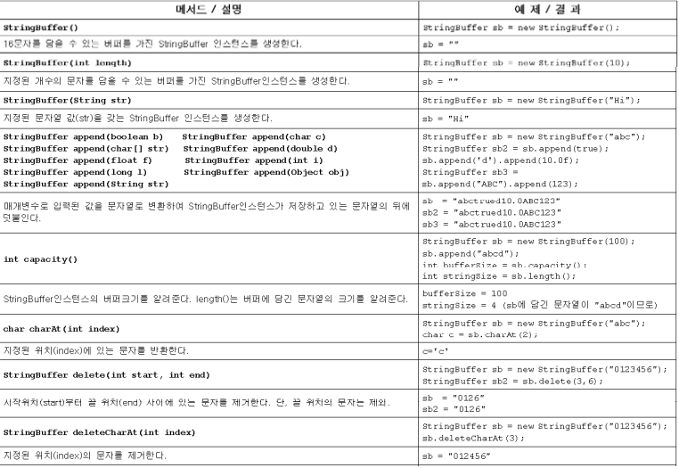
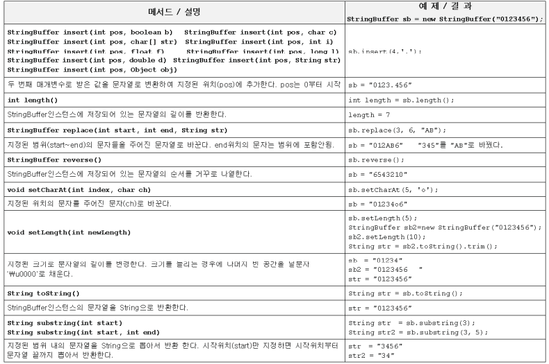
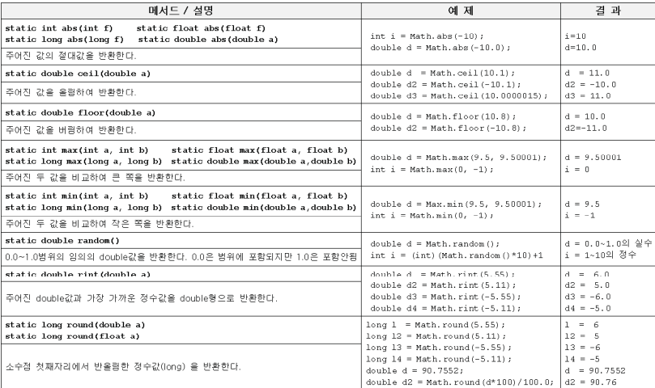
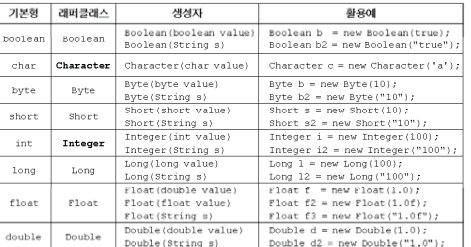

# java.lang 패키지, String

## 9. 0bject 클래스

- 모든 클래스의 최고 조상 

### 9-2 equal(object obj)

- 객체 자신과 주어진 객체를 비교한다. 같으면 true 다르면 false

~~~
public boolean equals(Object obj){
	//주소비교
	return (this==obj)
}
~~~

### 9-4 hash-code()

- 객체의 해시코드를 반환하는 메서드

- Object 클래스의 haseCode는 객체의 주소를 int로 변환해서 반환
- equals를 오버라이딩하면 , hashCode도 오버라이딩해야 한다 

- equals()의 결과가 true인 두객체는 해시코드도 같아야 하기 때문이다

### 9-5~6 toString(), toString()의 오버라이딩

- toString(): 객체를 문자열으로 변환하기 위한 메서드 

### 9-7 String 클래스 

- String 클래스 = 데이터(char[]) + 메서드(문자열 관련)

- 내용을 변경할수 없는 불변 클래스이다 

​		

​	이미지 처럼 합치게 되면 같은 주소로 합쳐지지 않고 다른주소를 새로 만들어서 합쳐진다

- 덧셈 연산자를 이용한 문자열 결합은 성능이 떨어진다

- 문자열 결합이나 변경이 잦다면 , 내용을 변경가능한 StringBuffer를 사용

### 9-8 문자열 비교

- String str = "abc"와 String str = new String("abc")의 비교

~~~
String str1 = "abc"; //문자열 리터럴 "abc"의 주소가 str1에 저장됨
String str2 = "abc"; //문자열 리터럴 "abc"의 주소가 str2에 저장됨
String str3 = new String("abc"); //새로운 String 인스턴스 생성
String str4 = new String("abc"); //새로운 String 인스턴스 생성
~~~

- 내용이 어차피 불가하기 때문에 같은 주소를 공유하는 방식을 써도 상관없다

~~~
str3 == str4 ? false
str3.equals(str4) ? true 
~~~

그래서 주소 비교(==)를  하지 말고 내용 비교(.equals)를 사용하자

### 9-9 문자열 리터럴

- 문자열 리터럴은 프로그램 실행시 자동으로 생성된다(constant pool에 저장)

~~~
Stirng s1 = "AAA";
String s2 = "AAA";
~~~

### 9-10 빈 문자열 ("", empty string)

- 내용이 없는 문자열 . 크기가 0인 char형 배열을 저장하는 문자열 

~~~
String s = ""; // 빈문자열을 초기화
~~~

- null로 초기화하는것 보다 빈문자열로 초기화 하는게 낮다

### 9-11 String클래스의 생성자와 메서드

### 9-12 join()과 StringJoiner

- join()은 여러문자열 사이에 구분자를 넣어서 결합한다 

~~~
String animals = "dog,cat,bear";
String[] arr = animals.split(",");
String str = String.join("-",arr);
System.out.println(str);
~~~

### 9-13 문자열과 기본형간의 변환

- 숫자를 문자열로 바꾸는 방법

~~~
int i = 100;
String str1 = i + ""; //100을 "100"으로 변환하는 방법1
String str2 = String.valueOf(i); //100을 "100"으로 변환하는 방법2 - 속도가 더 빠름
~~~

- 문자열을 숫자로 바꾸는 방법

~~~
int i = Integer.parseInt("100"); //"100"을 100으로 반환하는 방법1
int i2 = Integer.valueOf("100"); // "100"을 100으로 반환하는 방법2
Integer i2 = Integer.valueOf("100"); //원래는 반환 타입이 Integer
~~~

parse를 쓰던것들을 valueOf를 좀더 편리하게 사용해서 변환할수 있다 

### 9-15 StringBuffer 클래스 

- String 처럼 문자형 배열(char[])을 내부적으로 가지고 있다 

- String 과 달리 내용을 변경할수 있다 

### 9-17 StringBuffer의 변경

- StringBuffer는 String과 달리 내용 변경이 가능하다 

~~~
StringBuffer sb = new StringBuffer("abc");
sb.append("123"); // sb의 내용뒤에 "123"을 추가한다
~~~

### 9-18 StringBuffer의 비교

StringBuffer는 equals가 오버라이딩 되어있지않다 (주소비교)

그래서 String으로 변환후에 equals()로 비교해야 한다 

~~~
StringBuffer sb = new StringBuffer("abc");
StringBuffer sb2 = new StringBuffer("abc");

String s = sb.toStirng();
String s2 = sb2.toStirng();
System.out.println(s.equals(s2));
~~~

### 9-19 StringBuffer 메서드

### 9-21 StringBuilder

- StringBuffer는 동기화되어 있고 멀티 쓰레드에서 안전하다
- 멀티 쓰레드가 아닌경우 동기화는 불필요한 성능저하를 일으킨다
- 이럴땐 StringBuffer 대신 StringBuilder를 사용하면 성능향상

### 9-22 Math 클래스

- 수학 관련 static메서드의 집합

### 9-25 래퍼 클래스

- 기본형값을 감싸는 클래스

기본형에서 앞에 글자를 대문자로 변환 (예외도 있음)

### 9-27 Number 클래스

- 모든 숫자 래퍼 클래스의 조상

### 9-28 문자열을 숫자로 변환하기

~~~
int i = new Integer("100").intValue(); // 래퍼클래스를 int 기본형으로 변환
int i2 = Integer.parseInt("100");
Integer i3 = Integer.valueOf("100");
~~~

### 9-30 오토박싱 & 언박싱

int -> Integer 오토박싱 (자동으로 해줌)

Integer -> int 언박싱 

### 9-31 StringTokenizer

- 문자열을 우리가 지정하는 구분자로 문자열을 쪼개주는 클래스 
-  import해야함 

~~~
import java.util.StringTokenizer;

public static void main(String[] args){
	String str = "This is a string example using StringTokenizer";
	StringTokenizer tokenizer = new StringTokenizer(str);
	System.out.println(str);
	System.out.println();
		
    // countTokens()
    //남아있는 token의 개수를 반환
	System.out.println("total tokens:"+tokenizer.countTokens());
	// 아래의 while 코드는 반복문의 한 종류인데 어떻게 작동하는지 추후 반복문 챕터에서 공부할 예정이니 걱정하지 않으셔도 됩니다.
	while(tokenizer.hasMoreTokens()){
		System.out.println(tokenizer.nextToken());
	}
	System.out.println("total tokens:"+tokenizer.countTokens());
}
~~~

