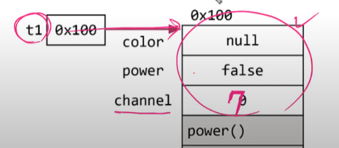
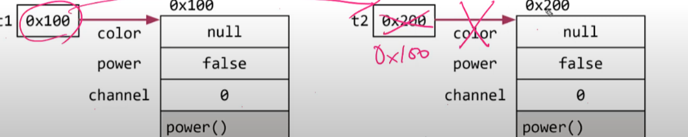
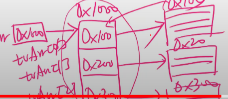
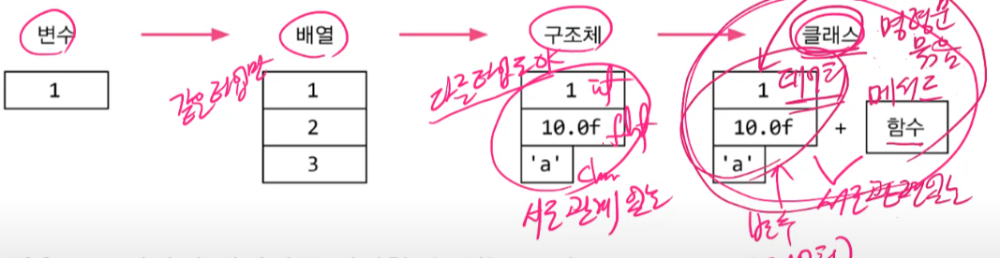
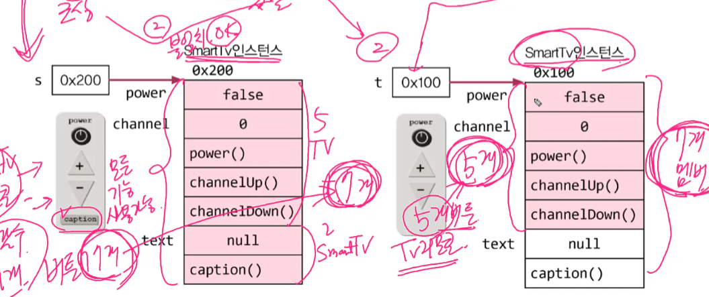
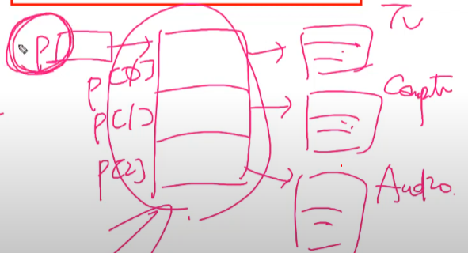
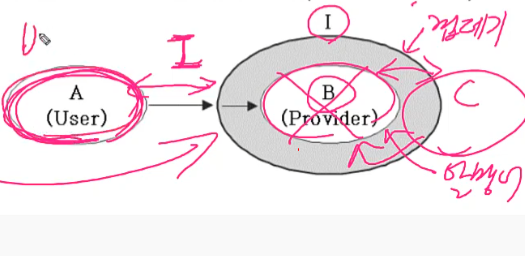

---
자바의 정석 참고 
---

# 객체지향

### 클래스

- 객체를 정의해 놓고 객체를 생성하는데 사용

### 객체

- 실제로 존재하는것, 객체가 가지고 있는 기능과 속성에따라 용도가 다름

ex) 클래스 - 설계도, 객체 - 제품 

**객체 = 속성(변수) + 기능(메서드)**

> **클래스 변수(cv, class variable)**, **인스턴스 변수(iv, instance variable)**, 그리고 **지역 변수(lv, local variable)**

## 

### 인스턴스

특정 클래스로부터 생성된 객체, 객체랑 거의 같다 

​					

​					인스턴스화

**클래스**  -----------------------> **인스턴스 (객체)**

### 객체생성

클래스명 변수명 ;

변수명 = new 클래스명();

~~~java
TV t; // TV 클래스 타입의 참조변수 t 선언 , t는 리모컨 
t = new Tv(); // TV 인스턴스 생성한후, 생성된 TV인스턴스의 주소를 t로 저장
// = 연결 
~~~

1. 참조변수 TV의 변수를 선언하고 
2. TV 인스턴스를 생성한후에 참조변수 t애 객체주소값을 넣어준다

### 객체의 생성과 사용 - 예제

~~~
Tv t1 = new Tv();
Tv t2 = new Tv();
t2 = t1; // t1의 주소값을 t2에 넣어준다
t1.channel = 7;
~~~

- 0x200객채는 사용불가하여서 가비지 컬렉터에소 자동으로 제거해준다 

### 객체배열

객체배열 == 참조변수 배열

~~~
TV[] tvArr = new Tv[3];
tvArr[0] = new Tv();
tvArr[1] = new Tv();
tvArr[2] = new Tv();
~~~

### 클래스 정의

1. 변수 - 하나의 데이터를 저장할수 있는 공간
2. 배열 - 같은 종류의 여러 데이터를 하나로 저장할수 있는 공간
3. 구조체 - 서로 관련된 여러 데이터(종류 관계x )를 하나로 저장할수 있는 공간

4. 클래스 - 데이터와 함수의 결합(구조체+함수)

 

### 선언 위치에 따른 변수의 종류

~~~java
class varivales
{
	int iv;  // 인스턴스 변수
	static int cv; // 클래스 변수(static변수, 공유변수)
	
	void method()
	{
		int lv = 0; //지역변수 
	}
}
~~~

|   변수의 종류    |        선언 위치        |           생성시기           |
| :--------------: | :---------------------: | :--------------------------: |
|  클래스 변수 cv  |       클래스 영역       |  클래스가 메모리에 올라갈때  |
| 인스턴수 변수 iv |       클래스 영역       |   인스턴스가 생성되었을때    |
|   지역변수 lv    | 클래스 영역 이외의 영역 | 변수 선언문이 수행이되었을때 |

그래서 cv는 객체생성 없이 사용이 가능하다

### 클래스 변수와 인스턴스 변수

~~~java
class Card{
	String kind;
	int number;
	
	static int width = 100;
	static int height = 250;
}

Card c = new Card();
c.kind = "HERART";
c.number = 5;
// 가능은 한데 권장 x 
c.width = 200; 
c.height = 300;
// 클래스 변수를 사용할때는 이방법 권장
Card.width = 200;
Card.height = 300;
~~~

### 메서드

1. 문장들을 묶어 놓은 것 

2. 값을 입력을 받아서 처리하고 , 결과를 반환하는것 

3.  하나의 메서드는 한가지 기능만 수행하도록 작성

~~~java
int add(int x, int y){
	int result = x + y;
	return result;
}
~~~

※ 메서드, 함수 차이 

- 거의 동일하지만 메서드는 클래스안에 있어야 한다 

#### 메서드 장점

- 코드의 중복을 줄일수 있다
- 코드를 재상용할수 있다
- 코드가 간결해서 이해하기 쉬워진다

### return 문

실행 중인 메서드를 종료하고 호출한 곳으로 되돌아간다

- 반환타입이 void이면 생략가능

### 호출 스택

스택 : 밑이 막힌 상자. 위에 차곡차곡 쌓인다

- 메서드 수행에 필요한 메모리가 저장되는 공간
- 메서드가 호출되면 호출스택에 메모리 할당, 종료되면 해제

### 기본형 매개변수

- 기본형 매개변수- 변수의 값을 읽기만 가능
- 참조형 매개변수 - 변수의 값을 읽고 변경할수 있다 

### 인스턴스 메서드와 static 매서드

1. 인스턴스 메서드
   - 인스턴스 생성후, '참조변수.메서드이름()'으로 호출
   
   - 인스턴스 멤버와 관련된 작업을 하는 메서드

   - 메서드 내에서 인스턴스 변수 사용가능 
   
     
   
2. staitc 메서드 (iv를 사용하지 않을때 붙임)

   - 객체생성없이 '클래스이름.메서드이름()'으로 호출
   - 인스턴스 멤버와 관련없는 작업을 하는 메서드
   - 메서드 내에서 인스턴스 변수 사용불가

※ 객체란 ? iv 묶음이다

~~~~java

class MyMath2{
	long a,b; // iv (인스턴스 변수)
	
	//매개변수로 받는게 없기 때문에 인스턴스 변수를 사용하게 된다 
	long add(){
		return a + b;
	}
	
	//가장 가까운 변수를 사용하게 된다
	static long add(long a, loing b){
		return a +b;
	}
}

class MathTest2{
	public static void main(String args[]){
		System.out.println(MyMath2.add(200L,100L)); // 클래스메서드 호출 (객체생성없이 호출)
		MyMath2 mm = new MyMath2(); // 인스턴스 생성 
		mm.a == 200L;
		mm.b == 300L;
		System.out.println(mm.add()); //인스턴스메서드 호출
	}
}
~~~~

#### static을 언제 붙여야 할까?

- 속성중에서 공통속성에 static을 붙인다
- **인스턴스 멤버(iv,im)을 사용하지 않는** 메서드에 static을 붙인다

|                 | 인스턴스 변수 | 클래스 변수 | 인스턴스 메서드 | static 메서드 | 이유                            |
| --------------- | ------------- | ----------- | --------------- | ------------- | ------------------------------- |
| 인스턴스 메서드 | O             | O           | O               | O             |                                 |
| static 메서드   | X             | O           | X               | O             | 객체를 생성해야지 사용할수 있다 |

### 오버로딩

한 클래스 안에 같은 이름의 메서드 여러개 정의하는것 

- 설립조건
  1. 메서드 이름이 같아야한다
  
  2. 매개변수의 개수 또는 타입이 달라야 한다
  
  3. 반환 타입은 영향이 없다
  
     

### 생성자

- 인스턴스가 생성될 때마다 호출되는 '**인스턴스 초기화 메서드**'
- 인스턴스 생성시 수행할 작업 (iv초기화)에 사용 

 - 설립조건
   1. 이름이 클래스 이름과 같아야 한다
   2. 리턴값이 없다(void 안붙임)
   3. 모든 클래스는 반드시 생성자를 가져야 한다

#### 기본생성자

- 생성자가 하나도 없을때만 , 컴파일러가 기본 생성자 자동추가

### 생성자 this()

- 생성자에서 다른 생성자 호출할때 사용

- 다른 생성자 호출시 첫줄에서만 사용가능

### 참조변수 this

- 인스턴스 자신을 가리키는 참조변수
- 인스턴스 메서드에서 사용가능
- 지역변수와 인스턴스 변수를 구별할때 사용

~~~java
Car(String color, String gearType, int door){
	// this.color는 iv, color는 lv
	this.color = color;
	this.gearType = gearType;
	this.door = door;
}
~~~

this는 생성자, 인스턴스 메서드에서 사용가능하다

`this와 this()는 비슷하게 생겼을뿐 완전히 다른것이다. this 는 '참조변수'이고, this()는 '생성자'이다`

### 변수의 초기화

지역변수는 수동초기화 해야한다

멤버변수는(iv, cv) 자동으로 초기화된다

### 멤버변수의 초기화

1. 명시적 초기화(=) <= 간단 초기화

   ~~~
   class Car{
   	int door = 4;            // 기본형 변수의 초기화
   	Engine e = new Engine();  // 참조형 변수의 초기화
   }
   ~~~

2. 초기화 블럭 <= 복잡 초기화

   인스턴스 초기화 블럭: { }

   클래스 초기화 블럭: static { }

3. 생성자 <= 복잡 초기화

- 클래스 변수 초기화 시점 : 클래스가 처음 로딩될때 단 한번 
- 인스턴스 변수 초기화 시점: 인스턴스가 생성될때 마다 

초기화 순서    cv -> iv   

 자동 -> 간단 -> 복

---

### 상속

- 기존의 클래스로 새로운 클래스를 작성하는것 (코드의 재사용)
- 두 클래스를 부모와 자식으로 관계를 맺어주는것

특징 

> 자손은 조상의 모든 멤버를 상속받는다
>
> 자손의 변경은 조상에 영향을 미치지 않는다

### 포함

- 클래스의 멤버로 참조변수를 선언하는것
- 작은 단위의 클래스를 만들고, 이 들을 조합해서 클래스를 만든다

~~~java
class Point{
	int x;
	int y;
}

class circle{
	Point c = new Point(); // 원점
	int r; // 반지름
}
~~~

### 클래스간의 관계 결정하기

**상속관계** '~은 ~이다.(is-a)'

**포함관계** '~은 ~을 가지고 있다(has-a)'

### 단일 상속

- 자바는 단일 상속만을 허용한다 

비중이 높은 클래스 하나만 상속관계로 나머지는 포함관계로 한다 

### Object 클래스

모든 클래스의 조상

- 부모가 없는 클래스는 자동적으로 Object클래스를 상속받게 된다

- 모든 클래스는 Object 클래스에 정의된 11개의 메서드를 상속받는다

  toString(), equals(Object obj), hashCode() , ...

### 오버라이딩 (재사용)

- 상속받은 조상 메서드를 자신에 맞게 변경하는 것

조건

	1. 선언부가 조상 클래스의 메서드와 일치해야 한다 
	2. 접근 제어자를 조상 클래스의 메서드보다 좁은 범위로 변경할수 없다
	3. 예외는 조상클래스의 메서드보다 많이 선언할수 없다

 

### 오버로딩 vs 오버라이딩

**오버로딩** : 기존에 없는 새로운 메서드를 정의하는것 (new)

**오버라이딩**: 상속받은 메서드의 내용을 변경하는것 (change, modify)

### 참조변수 super

- 객체 자신을 가르키는 참조변수. 인스턴스 메서드내에서만 존재
- 조상의 멤버를 자신의 멤버와 구별할때 사용 

- 조상의 멤버는 조상의 생성자를 호출해서 초기화

~~~java
Point3D(int x, int y, int z){
	super(x,y); //조상클래스의 생성자를 호출
	this.z = z; // 자신의 멤버를 초기화
}
~~~

- 생성자의 첫 줄에 반드시 생성자를 호출해야 한다 
- 그렇지 않으면 컴파일러가 생성자의 첫줄에 super(); 를 삽입

※ **클래스 만들때 기본생성자 만드는 것은 필수 !!!!!**

  

### 패키지

- 서로 관련된 클래스의 묶음

- 패키지 선언이 없으면 이름없는 패키지에 속하게 된다

### 클래스 패스 

- 클래스 파일의 위치를 알려주는 경로

### import문

- 클래스를 사용할때 패키지이름을 생략할 수 있다

- 컴파일러에게 클래스가 속한 패키지를 알려준다

- 패키지문과 클래스선언의 사이에 선언한다

~~~
import java.util.*;
import java.text.*;

----------------------> 
// 안됨
// *의 뜻은 자바 패키지의 모든 클래스라는 뜻이다. 
// 패키지는 포함이 안된다
import java.*;
~~~

- 이름이 같은 클래스가 속한 두 패키지를 import할때는 클래스앞에 패키지명을 붙여주어야 한다

~~~java
import java.sql.*;   //java.sql.Date - 클래스이름 동일
import java.util.*;  //java.util.Date

public class ImportTest{
    public static void main(String[] args){
        java.util.Date today = new java.util.Date();
    }
}
~~~

#### static import문

- static멤버를 사용할때 클래스 이름을 생략할수 있게 해준다

~~~java
import static java.lang.Integer.*; // Integer클래스의 모든 static메서드
import static java.lang.Math.random; //Math.random()만. 괄호 안붙임
import staitc java.lang.System.out; // sysyem.out을 out만으로 참조가능
~~~

### 접근제어자

private : 같은 클래스내에서만 접근이 가능

default : 같은 패키지 내에서만 접근 가능

protected : 같은 패키지 내에서, 그리고 다른 패키지의 자손클래스에서 접근 가능

public : 접근 제한이 없음

클래스에는 public, default만 사용가능 ,

멤버변수는 모두 가능 

### 접근 제어자 사용하는 이유

- 외부데이터를 보호하기 위해 사용 
- 외부에는 불필요한, 내부적으로만 사용하는것을 부분을 감추기 위해서
- 외부에서 직접접근을 막고 get,set형태로 변경해서 조건을 주어서 값이 이상하게 변경되는것을 막는다

### 다형성

여러가지 형태를 가질수 있는 능력

- 조상타입 참조변수로 자손타입 객체를 다루는 것

~~~
Tv t = new SmartTv();
~~~

- 자손 타입의 참조변수로 조상 타입의 객체를 가리킬수 없다

~~~java
Tv t = new SmartTv(); // OK 허용
SmartTv s = new Tv(); // 에러 허용 x
~~~

~~~
SmartTv s = new SmartTv();
Tv t = new SmartTv();
~~~

2번째 경우 리모컨 기능은 7개인 실제 기능되는거는 5개가 밖에 안된다

### 참조변수의 형변환

- 조상, 자손 관계의 참조변수는 서로 형변환 가능

~~~
Car c = (Car)f;
~~~

- 실제 객체보다 참조변수의 멤버가 더 많다면 에러가 발생할 수 있어 위험

### instanceof 연산자

참조변수의 형변환 가능여부 확인 , 가능하면 true 반환

형변환 전에 반드시 확인해야 한다

~~~
void doWork(Car c) {
	if(c instanceif FireEngine){            // 1.형변환 가능한지 확인
		FireEngine fe = (FireEngine)c;      // 2. 형변환
		fe.water();
		...
	}
}
~~~

자기뿐만 아니라 조상도 참이 나올수 있다

### 매개변수의 다형성

- 상속받는 클래스가 늘어나면 오버로딩해야 하는 메서드가 늘어나는 경우 발생하므로, 매개변수에 조상 타입을 쓰고, 다형성을 사용하여 메서드를 하나로 단축 가능

### 여러 종류의 객체를 배열로 다루기

- 조상타입의 배열에 자손들의 객체를 담을수 있다

  ~~~java
  Product p[] = new Product[3];
  p[0] = new Tv();
  p[1] = new Computer();
  p[2] = new Audio();
  ~~~

  

### 추상 클래스 

미완성 설계도, 미완성 메서드를 갖고 있는 클래스, 구현부가 없는 메서드

~~~
abstract class player{
	abstract void play(int pos); // 추상메서드(몸톰{}이 없는 미완성 메서드)
	abstract void stop();
}
~~~

- 인스턴스 생성이 불가 - 미완성된 설계도 이기 때문에 

- 상속을 통해서 추상메서드를 완성해야 인스턴스 생성 가능 

~~~
// 완성된 설계도이기 때문에 구현가능
class AudioPlayer extends Player{
	void play(int pos) {} //추상메서드를 구현
	void stop() {} // 추상메서드를 구현
}
~~~

- 자손마다 다르게 구현하게 될경우 사용

  

- 전부 구현할 필요없이 일부만 구현해도 되지만 그럴경우 앞에 abstract를 붙여주어야한다

~~~
abstract class AbstractPlayer extends Player{
	void play(int pos) {} ; 
}
~~~

- 추상화된 코드는 구체화된 코드보다 유연하다 . 변경에 유리 

### 인터페이스

- **추상메서드의 집합**

- 구현된 것이 전혀없는 설계도 . 껍데기(모든 멤버가 public)

- 상수,static,추상메서드만 가짐  - 상수, static은 부수적인 것임

~~~
interface 인터페이스 이름 {
	public static final 타입 상수이름 = 값; // 상수
	public abstract 메서드이름;           //추상메서드 , public abstract 생략가능
}
~~~

중간에 생략가능하고 일부분 써도 된다 

### 추상메서드와 인터페이스 차이

| 추상클래스                                                   | 인터페이스             |
| ------------------------------------------------------------ | ---------------------- |
| 일반클래스인데 추상메서드를 가지고있어서 멤버변수와 생성자를 가질수 있다 | 추상메서드만 갖고 있음 |

### 인터페이스 상속

- 인터페이스의 조상은 인터페이스만 가능 (object가 최고 조상 아님)
- 다중 상속이 가능 (추상메서드는 충돌해도 상관없음)
  - 구현부가 없어서 가능함

~~~java
interface Figthtable extends Movable, Attackable{}

interface Movable{
	void move(int x, int y);
}

interface Attackable{
	void attack(Unit u);
}
~~~

### 인터페이스 구현

- 인터페이스를 구현한다는 것이 추상클래스를 완성하는것과 비슷하다 

~~~
class 클래스이름 implements 인터페이스이름 {
	//인터페이스에 정의된 추상메서드를 모두 구현해야 한다
}
~~~

- 일부만 구현하는 경우 , 클래스 앞에 abstract를 붙여야 함

abstract class Fighter implememts Fightable {

​	public void move(int x, int y){ }

}

### 인터페이스를 이용한 다형성 

- 인터페이스도 구현 클래스의 부모이다 

~~~java
 class Fighter extends Unit implements Fightable {
 	public void move(int x, int y) { }
 	public void attack(Fightable f) { }
 }
 
 Unit u = new Fighter(); //조상클래스
 Fightable f = new Fighter(); // 인터페이스
~~~

- 인터페이스 타입 매개변수는 인터페이스 구현한 클래스의 객체만 가능 

~~~java
interface Fightable {
	void move(int x, int y);
	// Fightable 인터페이스를 구현한 클래스의 인스턴스만 가능
	void attack(Fightable f);
}
~~~

####  인터페이스를 메서드의 리턴타입으로 지정할수 있다

~~~
Fightable method() {
	Fighter f = new Fighter();
	return f;
}
~~~

### 인터페이스 장점

- 두대상 연결,대화,소통을 돕는 중간역할을 한다

- 선언과 구현을 분리시킬수 있다

- 인터페이스 덕분에 B가 변경되어도 A는 안바꿀수 있게 된다(느슨한 결합)

- 서로관계없는 클래스들을 관계를 맺어줄수 있다

### 디폴트 메서드와 static 메서드

- 인터페이스에 디폴트메서드, static메서드 추가 가능(JDK1.8부터)

- 기존 인터페이스의 문제점: 추상메서드를 추가를 하면은 기존에 인터페이스를 사용하는곳에 추가된 추상메서드를 모두 구현을 해야한다 . 그래서 이문제점을 해결하기 위해서 디폴트 메서드가 나옴

- 디폴트 메서드는 반드시 구현을 하지 않아도 된다

- 디폴트 메서드는 인스턴스 메서드

~~~java
interface MyInterface{
	void method();
    // 디폴트 메서드
	default void newMethod(){}
}
~~~

- 디폴트 메서드가 기존의 메서드와 충돌할때의 해결책
  - 그냥 직접 오버라이딩 하면 해결된다

### 내부클래스

- 클래스안의 클래스

~~~JAVA
class A {
	class B{
	// 객체 생성 없이도 A의 멤버접근 가능 
		...	
	}
}
~~~

장점  

- 내부 클래스에서 외부 클래스의 멤버들을 쉽게 접근 가능

- 코드의 복잡성을 줄일수 있다

### 내부 클래스의 종류와 특징

- 내부 클래스의 종류와 유효범위는 변수와 동일

~~~
class Outer{
	class InstanceInner {}
	static class StaticInner {}
	void myMethod() {
		class LocalInner {}
	}
}
~~~

- static클래스만 static멤버를 정의할수 있다 
- final static은 상수이므로 허용 
- 지역 내부 클래스는 메서드 내어서만 사용가능 

### 익명 클래스

-이름이 없는 일회용 클래스 . 정의와 생성을 동시에

~~~
new 조상클래스이름() {
// member declaration
}
new 구현인터페이스이름() {
// member declaration
}
~~~

