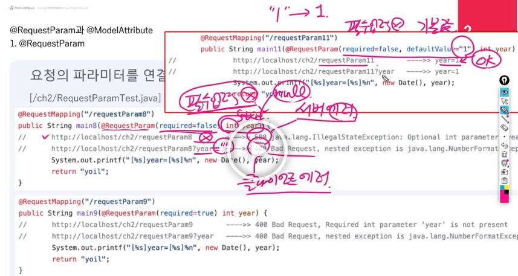
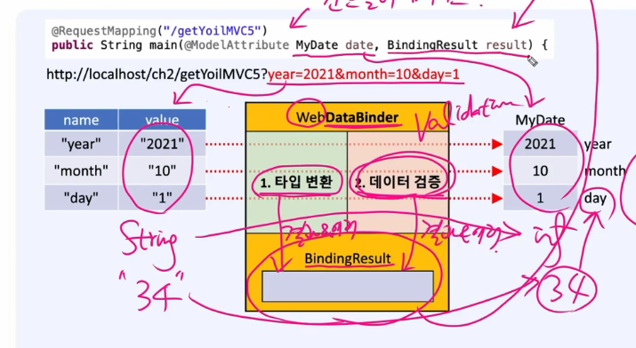

@RequestParam

요청의 파라미터를 연결할때 매개변수에 붙이는 애너테이션

파라미터 값이 없을대는 null  리턴, 값이 없을경우 빈값리턴 

하지만 숫자형을 받는경우 null,빈값을 받을수 없어서 defaultValue을 정해준다 

---

@ModelAttribute

적용 대상을 model속성으로 자동추가해주는 어노테이션

생략가능하다

---

컨트롤러 매개변수

@ RequestParam: 기본형

@ModelAtrribut: 참조형

둘다 생략이 가능하고 이 어노테이션이 없으면 생략이 되어 있는 것이다

----

webDataBinder

바인딩한 결과값을 bindingResult에 값이 들어간다