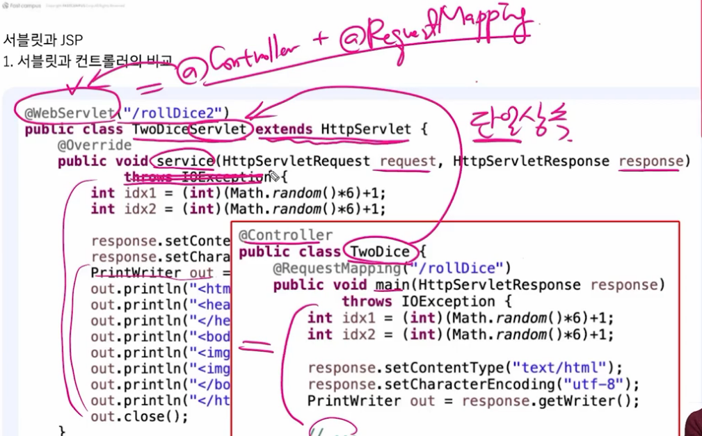
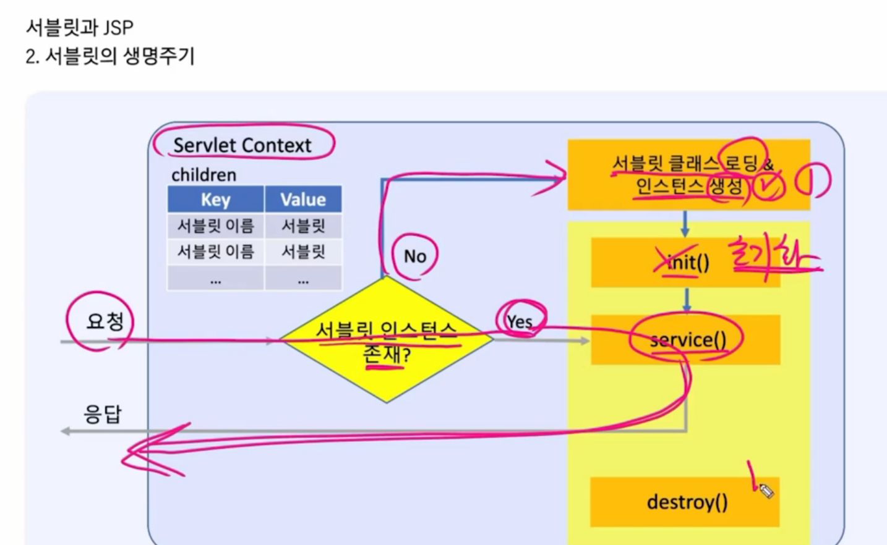
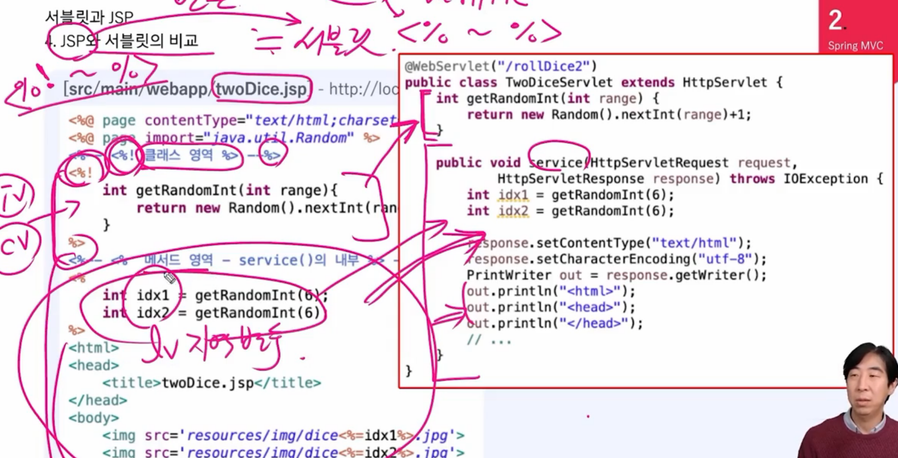
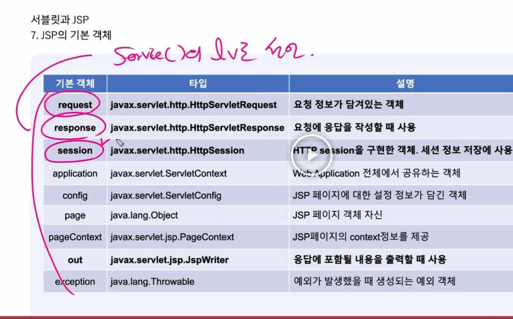
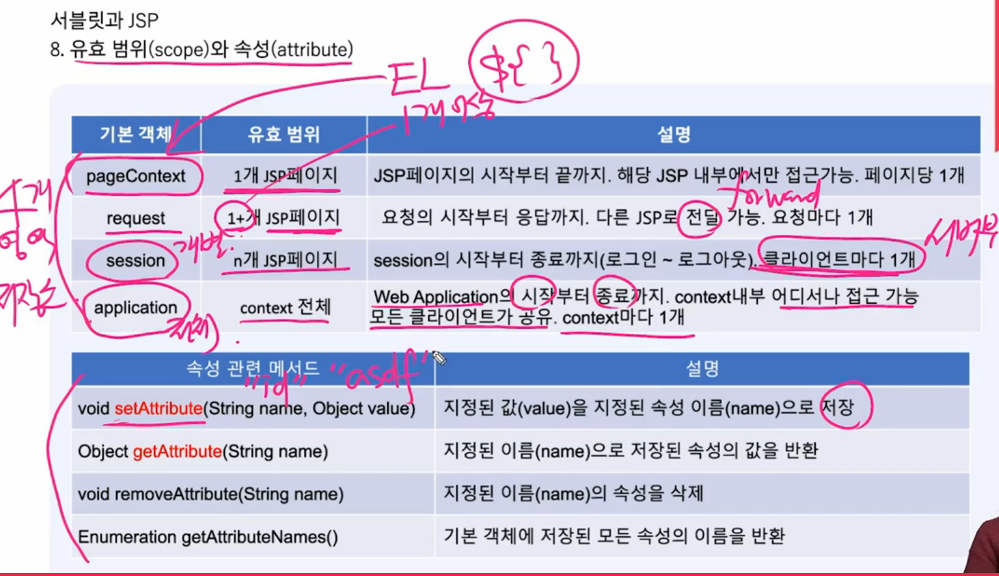

1. jsp하고 서블릿하고 거의 비슷함

2. 서블릿에서 좀더 발전한게 컨트롤러 

서블릿 인스턴스가 존재하면 서비스 함수로 가고 없으면 새로 인스턴스를 생성한다 

서블릿 : 싱글톤 1개 인스턴스 재활용

---

JSP

(java server page)

jsp 작성하면 서블릿으로 자동 변환 된다

jsp를 쓰면 오른쪽처럼 서블릿 코드로 변환된다

서블릿 : 늦은 초기화

스프링 : 빠른 초기화

서블릿 서비스쪽에 지역변수로 선언이 되어 있어서 기본적으로 jsp에서 사용을 할수 있다

---

저장 객체

---

필터

공통적인 요청 전처리와 응답후 처리에 사용, 로깅, 인코딩등에 사용