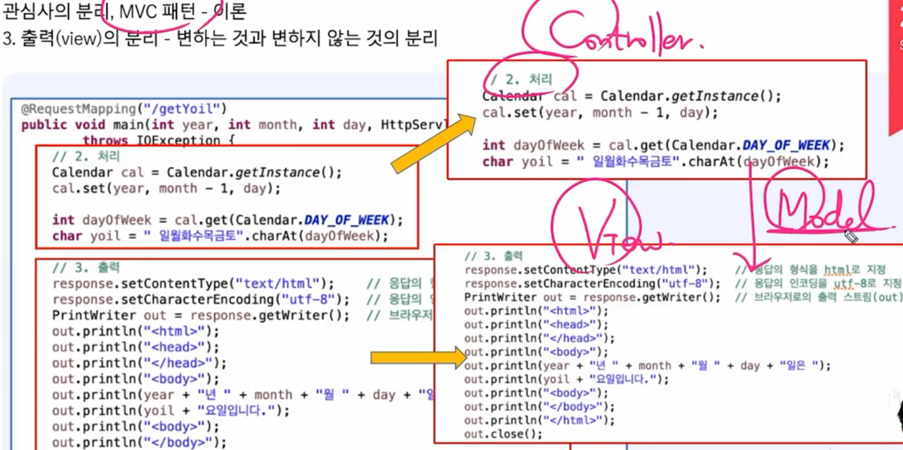
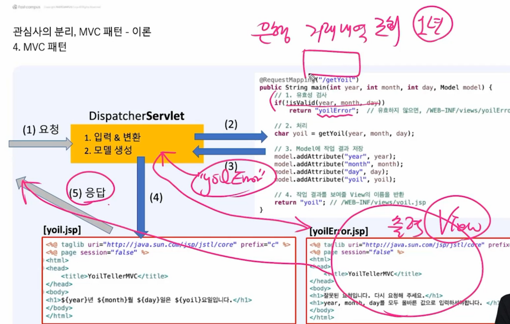

sts 파일 만들기 차이

spring start project 스프링 부트 

spring legacy project 스프링 

STS는 이클립스 + spring  플러그인 합친것

STS4 Spring boot 만 가능 

STS3 Spring + Spring boot 둘다 가능 

intellj

인텔리제이 

무료버전은 스프링 부트만 지원가능, 스프링은 지원 x 

---

mvc  

---

Controller  

프로그램 등록 

RequestMapping

URL과 메서드 연결 (맵핑, mapping)

1. tomcat이 객체생성 한후에 메서드 호출한다 

~~~
package com.fastcampus.ch2;

import org.springframework.stereotype.Controller;
import org.springframework.web.bind.annotation.RequestMapping;

@Controller 
public class Hello {
	
	int iv=10;// 인스턴스 변수 - iv
	static int cv = 20;// static 변수 - cv
	
	@RequestMapping("/hello")
	public void main() { // 인스턴스 메서드 -iv, cv를 둘다 가능
		System.out.println("Hello");
		System.out.println(cv);
		System.out.println(iv);
	}
	
	public static void main2() { // static 메서드 - cv만 가능 
		System.out.println(cv);
//		System.out.println(iv); // 에러
	}
}

~~~

이래서 가능하면 인스턴스 메서드를 쓰는 것이 좋다

---

httpSerlvetReqeust

httpServletRequest 메서드 

---

# MVC 패턴

OOP 5대설계원칙 - SOLID

1. SRP - 단일책임의 원칙

   - 분리 

     1. 관심사

     2. 변하는것, 변하지 않는것

     3. 공통코드 

        

controller 처리부분 

model 데이터를 주고받는 객체

view 출력부분

 

1. 요청이 들어오면 dispatcherservlet에서 입력을 받고 모델을 생성을한다 
2. 컨트롤러에서 모델객체와 값들을 받아서 처리하고 모델에 값을 저장한다 
3. 그리고 어떤 뷰로 반환할지 정해서 반환한다 
4. 뷰에서 값을 출력한다 

---

컨트롤러 메서드 반환 3가지 방법

