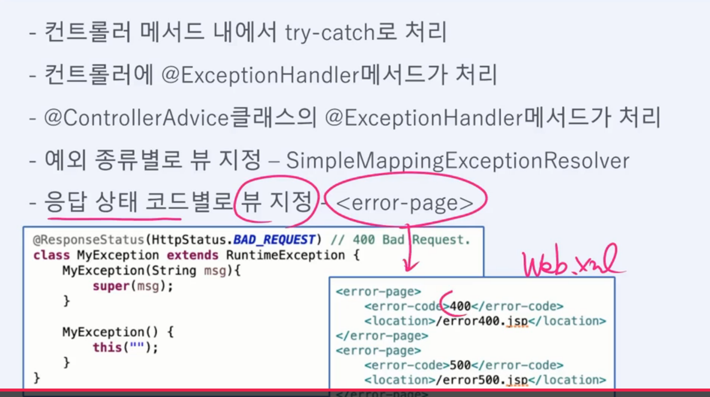

# 예외처리

@ExceptionHandler 

예외 처리를 위한 메서드를 작성하고 @ExceptionHandler 를 붙인다

@ControllerAdvice

@ControllerAdvice로 전역 예외 처리 클래스 작성 가능 (패키지 지정 가능)

예외처리 메서드가 중복된 경우, 컨트롤러 내의 예외 처리 메서드가 우선순위

~~~
@ControllerAdvice("com.fastcampus.ch2") // 지정된 패키지에서 발생한 예외 처리
//@ControllerAdvice // 모든 패키지 적용
~~~

@ResponseStatus

응답메세지의 상태 코드를 변경할때 사용

---

스프링 예외처리

5가지 방법

