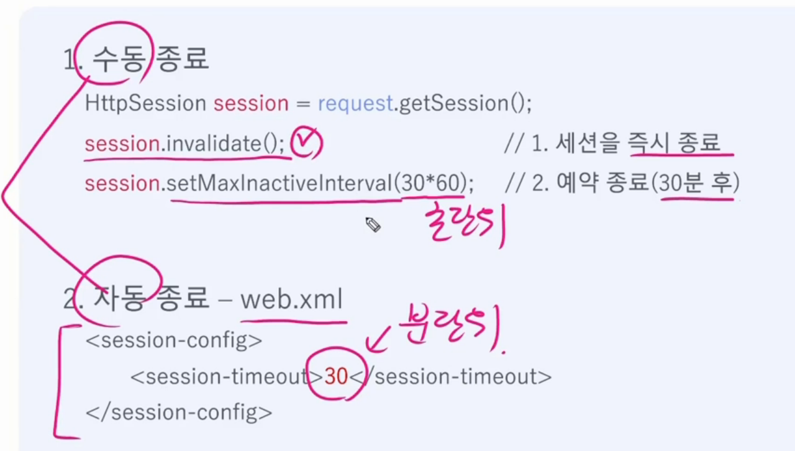

## 쿠키

이름과 값의 쌍으로 구성된 정보

아스키 문자만 가능 

~~~
id = asdf
name  value
유효기간 
~~~

 서버에서 생성후  전송 브라우저에 저장 

서버에 요청시 도메인 , 경로가 일치하는 경우에만 자동전송

쿠키 생성

~~~
Cookie cookie = new Cookie("id","asdf"); // 쿠키시간
cookie.setMaxAge(60*60*24); // 유효기간 설정
response.addCookie(cookie); // 응답에 쿠키 추가

//쿠키 삭제 (유효기간 0으로 설정)
cookie.setMaxAge(0); 
response.addCookie(cookie); 

~~~

---

세션

서로 관련된 요청드을 하나로 묶은것 

브라우저마다 개별 저장소를 서버에 제공

세션종료

세션이 필요없을때는 session=false;

세션 false 했다고 세션이 끊기는게 아닌 새로운 세션을 만들지 않는다는 것이다

세션이 필요없는 jsp 화면
