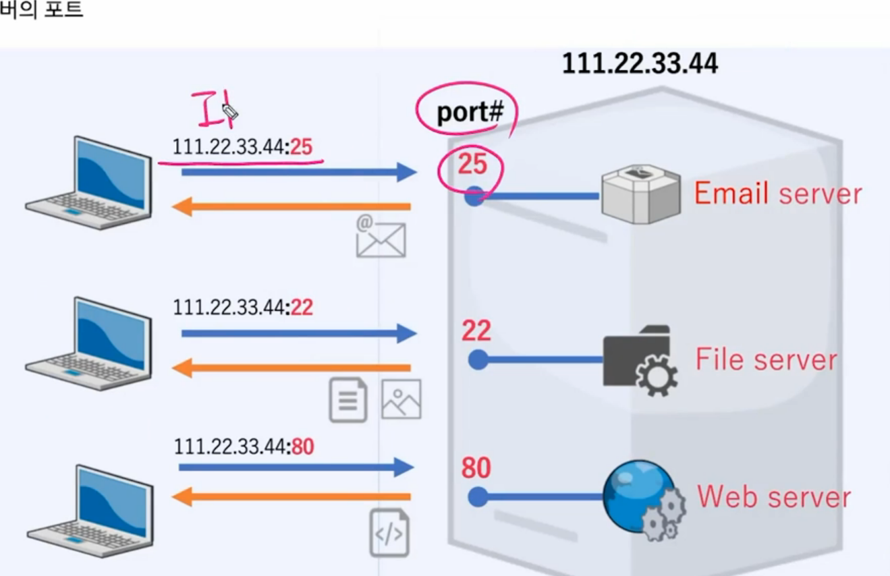
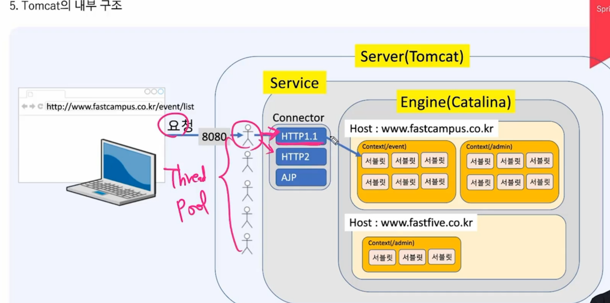
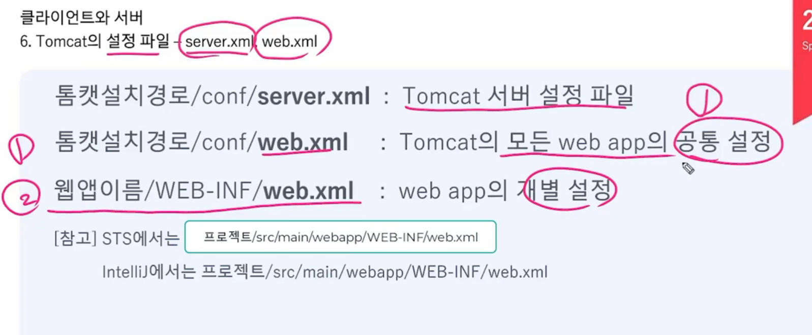
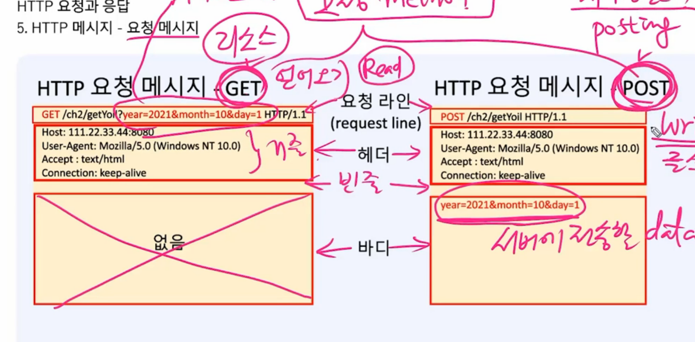

## 클라이언트, 서버

### 포트

서버에 여러개의 서버가 존재할수 있으므로 ip주소만으로는 구별이 불가하여 뒤에 포트번호를 써주어야 한다 

- 웹서버는 기본이 80이라 생략가능

---

### was

웹 애플리케이션 서버

클라이언트가 프로그램을 사용할수 있도록해주는것 

ex) tomcat

장점: 프로그램을 서버에 설치해서 업데이트에 용이

서버에서 클라이언트한테 실행결과만 전송한다

---

### 서블릿

작은 서버 프로그램

컨트롤러와 같은 개념이다 

thredpool을 미리 만들어 둔다

---

톰캣 설정파일

---

###  프로토콜

서로간의 통신을 위한 약속, 규칙

주고받을 데이터에 대한 형식을 정의한것

---

### HTTP

1. 단순하고 읽기 쉽다 

2. 상태를 유지하지 않는다(staeless) - 클라이언트 정보를 저장하지 않음

3. 확장이 가능하다. 커스텀 헤더 추가 가능

---

서버 에러 

100 : 정보

200: 성공

300: 재요청

400: 클라이언트 오류

EX) 404에러 

500: 서버 오류 

---

요청메세지 GET,POST   차이

GET은 요청라인에 

POST 는 바디에서

---

텍스트파일: 문자만 있는 저장되어 있는파일

바이너리 파일: 문자와 숫자로 이루어져 있는 파일 (보기어려움)

---

base64

바이너리 데이터를 텍스트 데이터로 변환

